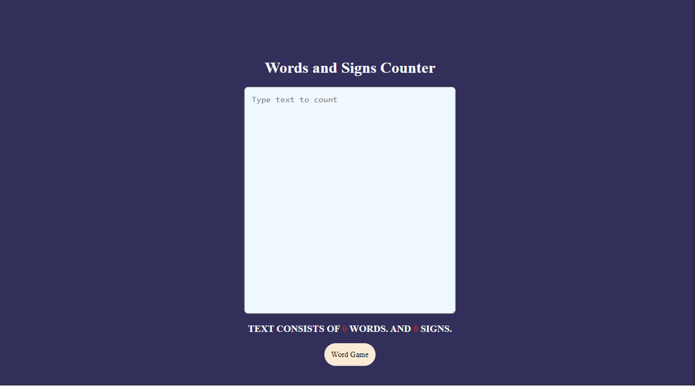
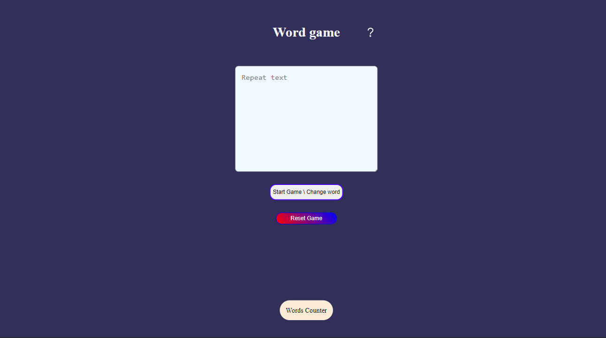

## Hey! Its my own project sign counter with game!

## Signs and words counter!

## Word game!

### Usefull resources : 
- https://catfact.ninja | - API i used
- https://developer.mozilla.org/en-US/docs/Learn/JavaScript/Objects/JSON                        | These two link help me with inserting random fact to JS by API
- https://developer.mozilla.org/en-US/docs/Learn/JavaScript/Objects/JSON#populating_the_header  |
- https://www.geeksforgeeks.org/how-to-use-the-javascript-fetch-api-to-get-data/
- https://stackoverflow.com/questions/5517597/plain-count-up-timer-in-javascript

- https://www.tutorialspoint.com/How-to-convert-a-negative-number-to-a-positive-one-in-JavaScript <-- How to reverse negative number to a positive number.

